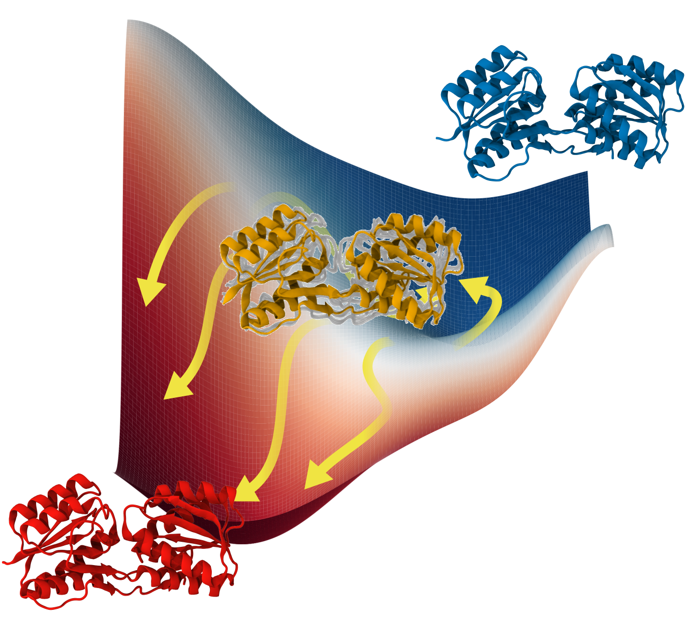

<!DOCTYPE html>
<html lang="en">

<h1>Gen-COMPAS: Generative committor-guided path sampling for rare events </h1>

This repository provides a modular pipeline for protein structure generation, committor analysis, clustering, and trajectory reweighting.
It combines <strong>diffusion models</strong> for structure generation with <strong>Variational Committor Networks (VCN)</strong> for reaction coordinate learning, along with postprocessing tools for clustering, occupancy analysis, and trajectory reweighting.

For computing statistical weights and estimating free energy landscapes, please refer to the <strong>Riteweight</strong> method described in: <a href="https://arxiv.org/html/2401.05597v1">https://arxiv.org/html/2401.05597v1</a>.

An implementation of Riteweight is available in the <strong><code>riteweight</code></strong> branch of this repository.

<h2>Overview</h2>

<ul>
<li>The main entry point is a single Python script that dispatches different stages of the workflow based on a YAML configuration file.</li>
<li>You can train models, perform inference, analyze trajectories, and perform reweighting with a unified interface.</li>
</ul>

<h2>Workflow Steps</h2>

<table>
<thead>
<tr>
<th>Step Name</th>
<th>Function</th>
<th>Description</th>
</tr>
</thead>
<tbody>
<tr>
<td><code>train_diffusion</code></td>
<td><code>train_diffusion_model()</code></td>
<td>Train a diffusion model for protein structure generation.</td>
</tr>
<tr>
<td><code>sample_diffusion</code></td>
<td><code>run_diffusion_inference()</code></td>
<td>Generate new protein conformations using a trained diffusion model.</td>
</tr>
<tr>
<td><code>train_committor</code></td>
<td><code>train_committor_model()</code></td>
<td>Train a Variational Committor Network (VCN) to predict committor probabilities from MD data.</td>
</tr>
<tr>
<td><code>committor_analysis</code></td>
<td><code>run_committor_analysis()</code></td>
<td>Perform committor-based slicing and analysis on generated structures.</td>
</tr>
<tr>
<td><code>clustering</code></td>
<td><code>run_clustering()</code></td>
<td>Cluster conformations using k-means and extract representative structures.</td>
</tr>
<tr>
<td><code>occupancy</code></td>
<td><code>add_occupancy()</code></td>
<td>Add hydrogen atoms and set occupancy flags in PDB files for visualization or targeted MD.</td>
</tr>
<tr>
<td><code>reweighting</code></td>
<td><code>run_reweighting()</code></td>
<td>Prepare trajectory data for statistical reweighting and dimensionality reduction (e.g., PCA).</td>
</tr>
</tbody>
</table>

<h2>Usage</h2>

<h3>Run a Specific Step</h3>

<pre><code>python run.py --step &lt;STEP_NAME&gt; --config &lt;PATH_TO_CONFIG&gt;
</code></pre>

<strong>Available <code>&lt;STEP_NAME&gt;</code> options:</strong>

<ul>
<li><code>train_diffusion</code></li>
<li><code>sample_diffusion</code></li>
<li><code>train_committor</code></li>
<li><code>committor_analysis</code></li>
<li><code>clustering</code></li>
<li><code>occupancy</code></li>
<li><code>reweighting</code></li>
</ul>

<h2>Configuration File (config.yaml)</h2>

All parameters for model training, inference, and analysis are specified in a single YAML file.
Below is a summary of each section.

<h3>1. Generative Model (Generative)</h3>

Train or sample from a diffusion model that learns to generate protein structures.

<strong>Key subsections:</strong>

<ul>
<li><strong>data:</strong> Input trajectory and topology paths.</li>
<li><strong>model:</strong> Embedding and architecture parameters (SchNet and attention layers).</li>
<li><strong>diffusion:</strong> Diffusion model hyperparameters (timesteps, beta schedule).</li>
<li><strong>training:</strong> Optimization and logging parameters.</li>
<li><strong>inference:</strong> Sampling configuration (checkpoint, output, batch size, etc.).</li>
</ul>

<h3>2. Variational Committor Network (VCN)</h3>

Train and evaluate a committor model to predict transition probabilities between states A and B.

<strong>Key fields:</strong>

<ul>
<li><strong>Sampling_path, topfile, atomselect:</strong> Input trajectory data.</li>
<li><strong>epochs, learning_rate, num_layers, num_nodes:</strong> Training hyperparameters.</li>
<li><strong>gendcdfile, model_fn, slice_dir:</strong> For slicing generated trajectories by committor values.</li>
<li><strong>cvs_to_plot:</strong> For visualization (2D or 3D plots).</li>
</ul>

<h3>3. Clustering (Clustering)</h3>

Cluster conformations based on atomic coordinates and extract representative structures.

<strong>Parameters include:</strong>

<ul>
<li><strong>n_clusters:</strong> Number of clusters (or auto-detected if null).</li>
<li><strong>n_per_cluster:</strong> Frames per cluster to output.</li>
<li><strong>select_farthest:</strong> Include both closest and farthest structures from centroids.</li>
</ul>

<h3>4. Occupancy (Occupancy)</h3>

Set atom occupancies or add hydrogens in PDB files.

<strong>Parameters include:</strong>

<ul>
<li><strong>pdb_dir, topology_file, pdb_file:</strong> Input files and directories.</li>
<li><strong>add_hydrogens:</strong> Whether to add hydrogens. <em>(Notice: Only for formatting, do NOT use hydrogens for TMD simulations)</em></li>
<li><strong>selection:</strong> MDTraj/MDAnalysis selection string for occupancy.</li>
</ul>

<h3>5. Reweighting (Reweighting)</h3>

Prepare trajectory data for statistical reweighting and dimensionality reduction (e.g., PCA or TICA).
Actual statistical weight calculation and free energy estimation should be performed using the
<strong>Riteweight</strong> method described in the paper linked above.

<strong>Key options:</strong>

<ul>
<li><strong>method:</strong> Dimensionality reduction approach (pca, tica, etc.).</li>
<li><strong>temperature:</strong> Simulation temperature.</li>
<li><strong>cvs_to_label, basin_A/B:</strong> Define basins for state labeling.</li>
<li><strong>colvars_mismatch:</strong> Handle colvars/dcd mismatch for NAMD outputs.</li>
</ul>

<h2>Dependencies</h2>

<strong>Core requirements:</strong>

<ul>
<li>Python &gt;= 3.9</li>
<li>PyTorch &gt;= 2.0</li>
<li>ASE, OpenMM, MDTraj, MDAnalysis</li>
<li>NumPy, SciPy, scikit-learn, pandas, matplotlib</li>
<li>PyYAML</li>
</ul>

<h2>Installation</h2>

Clone the repository and install dependencies. The full installation typically takes less than 1 minute.

<pre><code>git clone https://github.com/Tangcyu/Gen-COMPAS.git
</code></pre>

<h2>Demo</h2>

The initial training data for the Trp-cage fast-folding protein is located at:

<pre><code>example/0.DEMO_Trp-cage/Dataset/
</code></pre>

On an NVIDIA L40s GPU:

<ul>
<li>Training the diffusion model for 50 epochs takes approximately <strong>5 minutes</strong>, producing PyTorch checkpoints (.pt).</li>
<li>Generating 1,000 structures (.pdb format) using batch size 200 takes approximately <strong>1 minute</strong>.</li>
</ul>

<h2>Reproducibility</h2>

The <code>example/</code> folder contains all molecular dynamics input files used in the paper, prepared for the NAMD and Colvars software packages. These include:

<ul>
<li>Topologies, coordinates, velocities, and periodic boxes</li>
<li>Force field parameter files</li>
<li>Systems for NANMA, Tri-alanine, Trp-cage, RBP, and AAC</li>
</ul>

Running the complete Gen-COMPAS workflow on these inputs will reproduce the results presented in the manuscript.

</body>
</html>